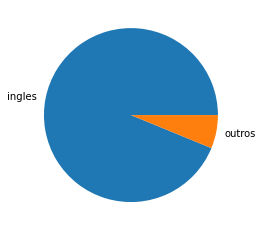

# Data_Science_Movies
<a href="https://colab.research.google.com/github/MuriloKrominski/Data_Science_Movies/blob/main/Data_Science.ipynb"></a>

<a href="https://colab.research.google.com/github/MuriloKrominski/Data_Science_Movies/blob/main/Data_Science.ipynb" target="_parent"></a>


```python
!pip install seaborn==0.9.0

import seaborn as sns
print(sns.__version__)
```

    Requirement already satisfied: seaborn==0.9.0 in /usr/local/lib/python3.6/dist-packages (0.9.0)
    Requirement already satisfied: pandas>=0.15.2 in /usr/local/lib/python3.6/dist-packages (from seaborn==0.9.0) (1.1.2)
    Requirement already satisfied: numpy>=1.9.3 in /usr/local/lib/python3.6/dist-packages (from seaborn==0.9.0) (1.18.5)
    Requirement already satisfied: matplotlib>=1.4.3 in /usr/local/lib/python3.6/dist-packages (from seaborn==0.9.0) (3.2.2)
    Requirement already satisfied: scipy>=0.14.0 in /usr/local/lib/python3.6/dist-packages (from seaborn==0.9.0) (1.4.1)
    Requirement already satisfied: python-dateutil>=2.7.3 in /usr/local/lib/python3.6/dist-packages (from pandas>=0.15.2->seaborn==0.9.0) (2.8.1)
    Requirement already satisfied: pytz>=2017.2 in /usr/local/lib/python3.6/dist-packages (from pandas>=0.15.2->seaborn==0.9.0) (2018.9)
    Requirement already satisfied: pyparsing!=2.0.4,!=2.1.2,!=2.1.6,>=2.0.1 in /usr/local/lib/python3.6/dist-packages (from matplotlib>=1.4.3->seaborn==0.9.0) (2.4.7)
    Requirement already satisfied: kiwisolver>=1.0.1 in /usr/local/lib/python3.6/dist-packages (from matplotlib>=1.4.3->seaborn==0.9.0) (1.2.0)
    Requirement already satisfied: cycler>=0.10 in /usr/local/lib/python3.6/dist-packages (from matplotlib>=1.4.3->seaborn==0.9.0) (0.10.0)
    Requirement already satisfied: six>=1.5 in /usr/local/lib/python3.6/dist-packages (from python-dateutil>=2.7.3->pandas>=0.15.2->seaborn==0.9.0) (1.15.0)
    0.9.0
    

    /usr/local/lib/python3.6/dist-packages/statsmodels/tools/_testing.py:19: FutureWarning: pandas.util.testing is deprecated. Use the functions in the public API at pandas.testing instead.
      import pandas.util.testing as tm
    

# Analisando as notas em geral


```python
import pandas as pd

notas = pd.read_csv("https://raw.githubusercontent.com/MuriloKrominski/Data_Science_Movies/main/ratings.csv")
notas.head()
```


<div>
<style scoped>
    .dataframe tbody tr th:only-of-type {
        vertical-align: middle;
    }

    .dataframe tbody tr th {
        vertical-align: top;
    }

    .dataframe thead th {
        text-align: right;
    }
</style>
<table border="1" class="dataframe">
  <thead>
    <tr style="text-align: right;">
      <th></th>
      <th>userId</th>
      <th>movieId</th>
      <th>rating</th>
      <th>timestamp</th>
    </tr>
  </thead>
  <tbody>
    <tr>
      <th>0</th>
      <td>1</td>
      <td>1</td>
      <td>4.0</td>
      <td>964982703</td>
    </tr>
    <tr>
      <th>1</th>
      <td>1</td>
      <td>3</td>
      <td>4.0</td>
      <td>964981247</td>
    </tr>
    <tr>
      <th>2</th>
      <td>1</td>
      <td>6</td>
      <td>4.0</td>
      <td>964982224</td>
    </tr>
    <tr>
      <th>3</th>
      <td>1</td>
      <td>47</td>
      <td>5.0</td>
      <td>964983815</td>
    </tr>
    <tr>
      <th>4</th>
      <td>1</td>
      <td>50</td>
      <td>5.0</td>
      <td>964982931</td>
    </tr>
  </tbody>
</table>
</div>


```python
notas.shape
```


    (100836, 4)


```python
notas.columns = ["usuarioId", "filmeId", "nota", "momento"]
notas.head()
```


<div>
<style scoped>
    .dataframe tbody tr th:only-of-type {
        vertical-align: middle;
    }

    .dataframe tbody tr th {
        vertical-align: top;
    }

    .dataframe thead th {
        text-align: right;
    }
</style>
<table border="1" class="dataframe">
  <thead>
    <tr style="text-align: right;">
      <th></th>
      <th>usuarioId</th>
      <th>filmeId</th>
      <th>nota</th>
      <th>momento</th>
    </tr>
  </thead>
  <tbody>
    <tr>
      <th>0</th>
      <td>1</td>
      <td>1</td>
      <td>4.0</td>
      <td>964982703</td>
    </tr>
    <tr>
      <th>1</th>
      <td>1</td>
      <td>3</td>
      <td>4.0</td>
      <td>964981247</td>
    </tr>
    <tr>
      <th>2</th>
      <td>1</td>
      <td>6</td>
      <td>4.0</td>
      <td>964982224</td>
    </tr>
    <tr>
      <th>3</th>
      <td>1</td>
      <td>47</td>
      <td>5.0</td>
      <td>964983815</td>
    </tr>
    <tr>
      <th>4</th>
      <td>1</td>
      <td>50</td>
      <td>5.0</td>
      <td>964982931</td>
    </tr>
  </tbody>
</table>
</div>


```python
notas['nota'].unique()
```


    array([4. , 5. , 3. , 2. , 1. , 4.5, 3.5, 2.5, 0.5, 1.5])


```python
notas['nota'].value_counts()
```


    4.0    26818
    3.0    20047
    5.0    13211
    3.5    13136
    4.5     8551
    2.0     7551
    2.5     5550
    1.0     2811
    1.5     1791
    0.5     1370
    Name: nota, dtype: int64


```python
print("Media",notas['nota'].mean())
print("Mediana",notas['nota'].median())
```

    Media 3.501556983616962
    Mediana 3.5
    


```python
notas.nota.head()
```


    0    4.0
    1    4.0
    2    4.0
    3    5.0
    4    5.0
    Name: nota, dtype: float64


```python
notas.nota.plot(kind='hist')
```


    <matplotlib.axes._subplots.AxesSubplot at 0x7f2ebc365dd8>


    

    


```python
notas.nota.describe()
```


    count    100836.000000
    mean          3.501557
    std           1.042529
    min           0.500000
    25%           3.000000
    50%           3.500000
    75%           4.000000
    max           5.000000
    Name: nota, dtype: float64


```python
import seaborn as sns

sns.boxplot(notas.nota)
```


    <matplotlib.axes._subplots.AxesSubplot at 0x7f2ebc25e940>


    

    


# Olhando os filmes


```python
filmes = pd.read_csv("https://raw.githubusercontent.com/MuriloKrominski/Data_Science_Movies/main/movies.csv")
filmes.columns = ["filmeId", "titulo", "generos"]
filmes.head()
```


<div>
<style scoped>
    .dataframe tbody tr th:only-of-type {
        vertical-align: middle;
    }

    .dataframe tbody tr th {
        vertical-align: top;
    }

    .dataframe thead th {
        text-align: right;
    }
</style>
<table border="1" class="dataframe">
  <thead>
    <tr style="text-align: right;">
      <th></th>
      <th>filmeId</th>
      <th>titulo</th>
      <th>generos</th>
    </tr>
  </thead>
  <tbody>
    <tr>
      <th>0</th>
      <td>1</td>
      <td>Toy Story (1995)</td>
      <td>Adventure|Animation|Children|Comedy|Fantasy</td>
    </tr>
    <tr>
      <th>1</th>
      <td>2</td>
      <td>Jumanji (1995)</td>
      <td>Adventure|Children|Fantasy</td>
    </tr>
    <tr>
      <th>2</th>
      <td>3</td>
      <td>Grumpier Old Men (1995)</td>
      <td>Comedy|Romance</td>
    </tr>
    <tr>
      <th>3</th>
      <td>4</td>
      <td>Waiting to Exhale (1995)</td>
      <td>Comedy|Drama|Romance</td>
    </tr>
    <tr>
      <th>4</th>
      <td>5</td>
      <td>Father of the Bride Part II (1995)</td>
      <td>Comedy</td>
    </tr>
  </tbody>
</table>
</div>


```python
notas.head()
```


<div>
<style scoped>
    .dataframe tbody tr th:only-of-type {
        vertical-align: middle;
    }

    .dataframe tbody tr th {
        vertical-align: top;
    }

    .dataframe thead th {
        text-align: right;
    }
</style>
<table border="1" class="dataframe">
  <thead>
    <tr style="text-align: right;">
      <th></th>
      <th>usuarioId</th>
      <th>filmeId</th>
      <th>nota</th>
      <th>momento</th>
    </tr>
  </thead>
  <tbody>
    <tr>
      <th>0</th>
      <td>1</td>
      <td>1</td>
      <td>4.0</td>
      <td>964982703</td>
    </tr>
    <tr>
      <th>1</th>
      <td>1</td>
      <td>3</td>
      <td>4.0</td>
      <td>964981247</td>
    </tr>
    <tr>
      <th>2</th>
      <td>1</td>
      <td>6</td>
      <td>4.0</td>
      <td>964982224</td>
    </tr>
    <tr>
      <th>3</th>
      <td>1</td>
      <td>47</td>
      <td>5.0</td>
      <td>964983815</td>
    </tr>
    <tr>
      <th>4</th>
      <td>1</td>
      <td>50</td>
      <td>5.0</td>
      <td>964982931</td>
    </tr>
  </tbody>
</table>
</div>


# Analisando algumas notas especificas por filme


```python
notas.query("filmeId==1").nota.mean()
```


    3.9209302325581397


```python
notas.query("filmeId==2").nota.mean()
```


    3.4318181818181817


```python
medias_por_filme = notas.groupby("filmeId").mean().nota
medias_por_filme.head()
```


    filmeId
    1    3.920930
    2    3.431818
    3    3.259615
    4    2.357143
    5    3.071429
    Name: nota, dtype: float64


```python
medias_por_filme.plot(kind='hist')
```


    <matplotlib.axes._subplots.AxesSubplot at 0x7f2ebba37f28>


    

    


```python
import matplotlib.pyplot as plt

plt.figure(figsize=(5,8))
sns.boxplot(y=medias_por_filme)
```


    <matplotlib.axes._subplots.AxesSubplot at 0x7f2ebaa220f0>


    

    


```python
medias_por_filme.describe()
```


    count    9724.000000
    mean        3.262448
    std         0.869874
    min         0.500000
    25%         2.800000
    50%         3.416667
    75%         3.911765
    max         5.000000
    Name: nota, dtype: float64


```python
sns.distplot(medias_por_filme)
```


    <matplotlib.axes._subplots.AxesSubplot at 0x7f2eba9438d0>


    

    


```python
plt.hist(medias_por_filme)
plt.title("Histograma das médias dos filmes")
```


    Text(0.5, 1.0, 'Histograma das médias dos filmes')


    

    


```python
tmdb = pd.read_csv("https://raw.githubusercontent.com/MuriloKrominski/Data_Science_Movies/main/tmdb_5000_movies.csv")
tmdb.head()
```


<div>
<style scoped>
    .dataframe tbody tr th:only-of-type {
        vertical-align: middle;
    }

    .dataframe tbody tr th {
        vertical-align: top;
    }

    .dataframe thead th {
        text-align: right;
    }
</style>
<table border="1" class="dataframe">
  <thead>
    <tr style="text-align: right;">
      <th></th>
      <th>budget</th>
      <th>genres</th>
      <th>homepage</th>
      <th>id</th>
      <th>keywords</th>
      <th>original_language</th>
      <th>original_title</th>
      <th>overview</th>
      <th>popularity</th>
      <th>production_companies</th>
      <th>production_countries</th>
      <th>release_date</th>
      <th>revenue</th>
      <th>runtime</th>
      <th>spoken_languages</th>
      <th>status</th>
      <th>tagline</th>
      <th>title</th>
      <th>vote_average</th>
      <th>vote_count</th>
    </tr>
  </thead>
  <tbody>
    <tr>
      <th>0</th>
      <td>237000000</td>
      <td>[{"id": 28, "name": "Action"}, {"id": 12, "nam...</td>
      <td>http://www.avatarmovie.com/</td>
      <td>19995</td>
      <td>[{"id": 1463, "name": "culture clash"}, {"id":...</td>
      <td>en</td>
      <td>Avatar</td>
      <td>In the 22nd century, a paraplegic Marine is di...</td>
      <td>150.437577</td>
      <td>[{"name": "Ingenious Film Partners", "id": 289...</td>
      <td>[{"iso_3166_1": "US", "name": "United States o...</td>
      <td>2009-12-10</td>
      <td>2787965087</td>
      <td>162.0</td>
      <td>[{"iso_639_1": "en", "name": "English"}, {"iso...</td>
      <td>Released</td>
      <td>Enter the World of Pandora.</td>
      <td>Avatar</td>
      <td>7.2</td>
      <td>11800</td>
    </tr>
    <tr>
      <th>1</th>
      <td>300000000</td>
      <td>[{"id": 12, "name": "Adventure"}, {"id": 14, "...</td>
      <td>http://disney.go.com/disneypictures/pirates/</td>
      <td>285</td>
      <td>[{"id": 270, "name": "ocean"}, {"id": 726, "na...</td>
      <td>en</td>
      <td>Pirates of the Caribbean: At World's End</td>
      <td>Captain Barbossa, long believed to be dead, ha...</td>
      <td>139.082615</td>
      <td>[{"name": "Walt Disney Pictures", "id": 2}, {"...</td>
      <td>[{"iso_3166_1": "US", "name": "United States o...</td>
      <td>2007-05-19</td>
      <td>961000000</td>
      <td>169.0</td>
      <td>[{"iso_639_1": "en", "name": "English"}]</td>
      <td>Released</td>
      <td>At the end of the world, the adventure begins.</td>
      <td>Pirates of the Caribbean: At World's End</td>
      <td>6.9</td>
      <td>4500</td>
    </tr>
    <tr>
      <th>2</th>
      <td>245000000</td>
      <td>[{"id": 28, "name": "Action"}, {"id": 12, "nam...</td>
      <td>http://www.sonypictures.com/movies/spectre/</td>
      <td>206647</td>
      <td>[{"id": 470, "name": "spy"}, {"id": 818, "name...</td>
      <td>en</td>
      <td>Spectre</td>
      <td>A cryptic message from Bond’s past sends him o...</td>
      <td>107.376788</td>
      <td>[{"name": "Columbia Pictures", "id": 5}, {"nam...</td>
      <td>[{"iso_3166_1": "GB", "name": "United Kingdom"...</td>
      <td>2015-10-26</td>
      <td>880674609</td>
      <td>148.0</td>
      <td>[{"iso_639_1": "fr", "name": "Fran\u00e7ais"},...</td>
      <td>Released</td>
      <td>A Plan No One Escapes</td>
      <td>Spectre</td>
      <td>6.3</td>
      <td>4466</td>
    </tr>
    <tr>
      <th>3</th>
      <td>250000000</td>
      <td>[{"id": 28, "name": "Action"}, {"id": 80, "nam...</td>
      <td>http://www.thedarkknightrises.com/</td>
      <td>49026</td>
      <td>[{"id": 849, "name": "dc comics"}, {"id": 853,...</td>
      <td>en</td>
      <td>The Dark Knight Rises</td>
      <td>Following the death of District Attorney Harve...</td>
      <td>112.312950</td>
      <td>[{"name": "Legendary Pictures", "id": 923}, {"...</td>
      <td>[{"iso_3166_1": "US", "name": "United States o...</td>
      <td>2012-07-16</td>
      <td>1084939099</td>
      <td>165.0</td>
      <td>[{"iso_639_1": "en", "name": "English"}]</td>
      <td>Released</td>
      <td>The Legend Ends</td>
      <td>The Dark Knight Rises</td>
      <td>7.6</td>
      <td>9106</td>
    </tr>
    <tr>
      <th>4</th>
      <td>260000000</td>
      <td>[{"id": 28, "name": "Action"}, {"id": 12, "nam...</td>
      <td>http://movies.disney.com/john-carter</td>
      <td>49529</td>
      <td>[{"id": 818, "name": "based on novel"}, {"id":...</td>
      <td>en</td>
      <td>John Carter</td>
      <td>John Carter is a war-weary, former military ca...</td>
      <td>43.926995</td>
      <td>[{"name": "Walt Disney Pictures", "id": 2}]</td>
      <td>[{"iso_3166_1": "US", "name": "United States o...</td>
      <td>2012-03-07</td>
      <td>284139100</td>
      <td>132.0</td>
      <td>[{"iso_639_1": "en", "name": "English"}]</td>
      <td>Released</td>
      <td>Lost in our world, found in another.</td>
      <td>John Carter</td>
      <td>6.1</td>
      <td>2124</td>
    </tr>
  </tbody>
</table>
</div>


```python
tmdb.original_language.unique() # categorica nominal
```


    array(['en', 'ja', 'fr', 'zh', 'es', 'de', 'hi', 'ru', 'ko', 'te', 'cn',
           'it', 'nl', 'ta', 'sv', 'th', 'da', 'xx', 'hu', 'cs', 'pt', 'is',
           'tr', 'nb', 'af', 'pl', 'he', 'ar', 'vi', 'ky', 'id', 'ro', 'fa',
           'no', 'sl', 'ps', 'el'], dtype=object)


```python
# primeiro grau
# segundo grau
# terceiro grau
# 1 grau < 2 grau < 3 grau # categorica ordinal
```


```python
# budget => orcamento => quantitativa continuo 
```


```python
# quantidade de votos => 1, 2, 3, 4, nao tem 2.5 votos.
# notas do movielens => 0.5, 1, 1.5, ... ,5 nao tem 2.7
```


```python
tmdb["original_language"].value_counts().index
```


    Index(['en', 'fr', 'es', 'zh', 'de', 'hi', 'ja', 'it', 'cn', 'ru', 'ko', 'pt',
           'da', 'sv', 'nl', 'fa', 'he', 'th', 'cs', 'ar', 'ta', 'ro', 'id', 'te',
           'no', 'hu', 'pl', 'ps', 'sl', 'ky', 'nb', 'vi', 'tr', 'xx', 'af', 'is',
           'el'],
          dtype='object')


```python
tmdb["original_language"].value_counts().values
```


    array([4505,   70,   32,   27,   27,   19,   16,   14,   12,   11,   11,
              9,    7,    5,    4,    4,    3,    3,    2,    2,    2,    2,
              2,    1,    1,    1,    1,    1,    1,    1,    1,    1,    1,
              1,    1,    1,    1])


```python
contagem_de_lingua = tmdb["original_language"].value_counts().to_frame().reset_index()
contagem_de_lingua.columns = ["original_language", "total"]
contagem_de_lingua.head()
```


<div>
<style scoped>
    .dataframe tbody tr th:only-of-type {
        vertical-align: middle;
    }

    .dataframe tbody tr th {
        vertical-align: top;
    }

    .dataframe thead th {
        text-align: right;
    }
</style>
<table border="1" class="dataframe">
  <thead>
    <tr style="text-align: right;">
      <th></th>
      <th>original_language</th>
      <th>total</th>
    </tr>
  </thead>
  <tbody>
    <tr>
      <th>0</th>
      <td>en</td>
      <td>4505</td>
    </tr>
    <tr>
      <th>1</th>
      <td>fr</td>
      <td>70</td>
    </tr>
    <tr>
      <th>2</th>
      <td>es</td>
      <td>32</td>
    </tr>
    <tr>
      <th>3</th>
      <td>zh</td>
      <td>27</td>
    </tr>
    <tr>
      <th>4</th>
      <td>de</td>
      <td>27</td>
    </tr>
  </tbody>
</table>
</div>


```python
sns.barplot(x="original_language", y = "total", data = contagem_de_lingua)
```


    <matplotlib.axes._subplots.AxesSubplot at 0x7f2eba329240>


    

    


```python
sns.catplot(x = "original_language", kind="count", data = tmdb)
```


    <seaborn.axisgrid.FacetGrid at 0x7f2eba1c1668>


    

    


```python
plt.pie(contagem_de_lingua["total"], labels = contagem_de_lingua["original_language"])
```


    ([<matplotlib.patches.Wedge at 0x7f2eb787feb8>,
      <matplotlib.patches.Wedge at 0x7f2eba330438>,
      <matplotlib.patches.Wedge at 0x7f2eba330940>,
      <matplotlib.patches.Wedge at 0x7f2eba330e48>,
      <matplotlib.patches.Wedge at 0x7f2eb7896390>,
      <matplotlib.patches.Wedge at 0x7f2eb7896898>,
      <matplotlib.patches.Wedge at 0x7f2eb7896da0>,
      <matplotlib.patches.Wedge at 0x7f2eb78a22e8>,
      <matplotlib.patches.Wedge at 0x7f2eb78a27f0>,
      <matplotlib.patches.Wedge at 0x7f2eb78a2cf8>,
      <matplotlib.patches.Wedge at 0x7f2eb7869be0>,
      <matplotlib.patches.Wedge at 0x7f2eb782e710>,
      <matplotlib.patches.Wedge at 0x7f2eb782ec18>,
      <matplotlib.patches.Wedge at 0x7f2eb783b160>,
      <matplotlib.patches.Wedge at 0x7f2eb783b668>,
      <matplotlib.patches.Wedge at 0x7f2eb783bb70>,
      <matplotlib.patches.Wedge at 0x7f2eb78480b8>,
      <matplotlib.patches.Wedge at 0x7f2eb78485c0>,
      <matplotlib.patches.Wedge at 0x7f2eb7848ac8>,
      <matplotlib.patches.Wedge at 0x7f2eb7848fd0>,
      <matplotlib.patches.Wedge at 0x7f2eb7852518>,
      <matplotlib.patches.Wedge at 0x7f2eb7852a20>,
      <matplotlib.patches.Wedge at 0x7f2eb7852f28>,
      <matplotlib.patches.Wedge at 0x7f2eb785e470>,
      <matplotlib.patches.Wedge at 0x7f2eb785e978>,
      <matplotlib.patches.Wedge at 0x7f2eb785ee80>,
      <matplotlib.patches.Wedge at 0x7f2eb77eb3c8>,
      <matplotlib.patches.Wedge at 0x7f2eb77eb8d0>,
      <matplotlib.patches.Wedge at 0x7f2eb77ebdd8>,
      <matplotlib.patches.Wedge at 0x7f2eb77f5320>,
      <matplotlib.patches.Wedge at 0x7f2eb77f5828>,
      <matplotlib.patches.Wedge at 0x7f2eb77f5d30>,
      <matplotlib.patches.Wedge at 0x7f2eb7803278>,
      <matplotlib.patches.Wedge at 0x7f2eb7803780>,
      <matplotlib.patches.Wedge at 0x7f2eb7803c88>,
      <matplotlib.patches.Wedge at 0x7f2eb780f1d0>,
      <matplotlib.patches.Wedge at 0x7f2eb780f6d8>],
     [Text(-1.0791697536499925, 0.2130554923183512, 'en'),
      Text(1.0355355017029462, -0.3710339940124459, 'fr'),
      Text(1.0579676486019882, -0.3011718023181785, 'es'),
      Text(1.0687996606645356, -0.26012936274741094, 'zh'),
      Text(1.0773191105706255, -0.22222406260195313, 'de'),
      Text(1.0835167978583342, -0.18971386021801853, 'hi'),
      Text(1.0875756432724297, -0.16486121484618815, 'ja'),
      Text(1.0906010773146022, -0.14348968659882622, 'it'),
      Text(1.092883487371409, -0.12492270822755745, 'cn'),
      Text(1.0946390911069936, -0.10846778425161549, 'ru'),
      Text(1.0960865535188649, -0.09270527058984593, 'ko'),
      Text(1.0972054830031333, -0.07835896928789601, 'pt'),
      Text(1.097965443340663, -0.06687215586282344, 'da'),
      Text(1.0984565010300316, -0.05825217030171998, 'sv'),
      Text(1.0987803851616647, -0.0517847968421653, 'nl'),
      Text(1.0990363161210686, -0.04603450713357274, 'fa'),
      Text(1.0992355702663055, -0.04100196411527794, 'he'),
      Text(1.0993880184234357, -0.03668766750546649, 'th'),
      Text(1.0995021239019234, -0.033091985965784415, 'cs'),
      Text(1.099584941078101, -0.03021518416739545, 'ar'),
      Text(1.0996602312343366, -0.027338175536150495, 'ta'),
      Text(1.099727993855245, -0.024460979766119193, 'ro'),
      Text(1.0997882284769684, -0.02158361655264929, 'id'),
      Text(1.0998284639438185, -0.01942549610642471, 'te'),
      Text(1.0998529348820232, -0.01798670707495573, 'no'),
      Text(1.0998755236058106, -0.01654788726224571, 'hu'),
      Text(1.0998962300765243, -0.01510903913059323, 'pl'),
      Text(1.0999150542587282, -0.013670165142345335, 'ps'),
      Text(1.0999319961202083, -0.012231267759896247, 'sl'),
      Text(1.0999470556319713, -0.01079234944567632, 'ky'),
      Text(1.099960232768245, -0.00935341266215563, 'nb'),
      Text(1.0999715275064792, -0.007914459871831963, 'vi'),
      Text(1.0999809398273452, -0.006475493537234394, 'tr'),
      Text(1.0999884697147349, -0.005036516120911278, 'xx'),
      Text(1.0999941171557621, -0.0035975300854338356, 'af'),
      Text(1.0999978821407626, -0.0021585378933851127, 'is'),
      Text(1.0999997646632929, -0.0007195420073586872, 'el')])


    

    


```python
total_por_lingua = tmdb["original_language"].value_counts()
total_geral = total_por_lingua.sum()
total_de_ingles = total_por_lingua.loc["en"]
total_do_resto = total_geral - total_de_ingles
print(total_de_ingles, total_do_resto)
```

    4505 298
    


```python
dados = {
    'lingua' : ['ingles','outros'],
    'total' : [total_de_ingles, total_do_resto]
}
dados = pd.DataFrame(dados)
sns.barplot(x="lingua", y="total", data = dados)
```


    <matplotlib.axes._subplots.AxesSubplot at 0x7f2eb77ad2e8>


    

    


```python
plt.pie(dados["total"], labels = dados["lingua"])
```


    ([<matplotlib.patches.Wedge at 0x7f2eb772e828>,
      <matplotlib.patches.Wedge at 0x7f2eb772ed68>],
     [Text(-1.0791697536499925, 0.2130554923183512, 'ingles'),
      Text(1.0791697511565306, -0.2130555049482467, 'outros')])


    

    


```python
total_por_lingua_de_outros_filmes = tmdb.query("original_language != 'en'").original_language.value_counts()
total_por_lingua_de_outros_filmes
```


    fr    70
    es    32
    zh    27
    de    27
    hi    19
    ja    16
    it    14
    cn    12
    ko    11
    ru    11
    pt     9
    da     7
    sv     5
    nl     4
    fa     4
    he     3
    th     3
    id     2
    ro     2
    ar     2
    ta     2
    cs     2
    ps     1
    nb     1
    ky     1
    xx     1
    el     1
    no     1
    pl     1
    sl     1
    te     1
    tr     1
    vi     1
    hu     1
    af     1
    is     1
    Name: original_language, dtype: int64


```python
filmes_sem_lingua_original_em_ingles = tmdb.query("original_language != 'en'")

sns.catplot(x = "original_language", kind="count",
              data = filmes_sem_lingua_original_em_ingles)
```


    <seaborn.axisgrid.FacetGrid at 0x7f2eb773ce80>


    

    


```python
sns.catplot(x = "original_language", kind="count",
              data = filmes_sem_lingua_original_em_ingles,
              aspect = 2,
              palette="GnBu_d",
              order = total_por_lingua_de_outros_filmes.index)
```


    <seaborn.axisgrid.FacetGrid at 0x7f2eb770cb70>


    

    


# Revisando o papel da média, mediana, medidas de tendência central, dispersão, desvio padrão, box plot, histograma


```python
filmes.head(2)
```


<div>
<style scoped>
    .dataframe tbody tr th:only-of-type {
        vertical-align: middle;
    }

    .dataframe tbody tr th {
        vertical-align: top;
    }

    .dataframe thead th {
        text-align: right;
    }
</style>
<table border="1" class="dataframe">
  <thead>
    <tr style="text-align: right;">
      <th></th>
      <th>filmeId</th>
      <th>titulo</th>
      <th>generos</th>
    </tr>
  </thead>
  <tbody>
    <tr>
      <th>0</th>
      <td>1</td>
      <td>Toy Story (1995)</td>
      <td>Adventure|Animation|Children|Comedy|Fantasy</td>
    </tr>
    <tr>
      <th>1</th>
      <td>2</td>
      <td>Jumanji (1995)</td>
      <td>Adventure|Children|Fantasy</td>
    </tr>
  </tbody>
</table>
</div>


```python
notas_do_toy_story = notas.query("filmeId==1")
notas_do_jumanji = notas.query("filmeId==2")
print(len(notas_do_toy_story), len(notas_do_jumanji))
```

    215 110
    


```python
print("Nota média do Toy Story %.2f" % notas_do_toy_story.nota.mean())
print("Nota média do Jumanji %.2f" % notas_do_jumanji.nota.mean())
```

    Nota média do Toy Story 3.92
    Nota média do Jumanji 3.43
    


```python
print(notas_do_toy_story.nota.std(), notas_do_jumanji.nota.std())
```

    0.8348591407114045 0.8817134921476455
    


```python
print("Nota mediana do Toy Story %.2f" % notas_do_toy_story.nota.median())
print("Nota mediana do Jumanji %.2f" % notas_do_jumanji.nota.median())
```

    Nota mediana do Toy Story 4.00
    Nota mediana do Jumanji 3.50
    


```python
import numpy as np

filme1 = np.append(np.array([2.5] * 10), np.array([3.5] * 10))
filme2 = np.append(np.array([5] * 10), np.array([1] * 10))
```


```python
print(filme1.mean(), filme2.mean())
print(np.std(filme1), np.std(filme2))
print(np.median(filme1), np.median(filme2))
```

    3.0 3.0
    0.5 2.0
    3.0 3.0
    


```python
plt.hist(filme1)
plt.hist(filme2)
```


    (array([10.,  0.,  0.,  0.,  0.,  0.,  0.,  0.,  0., 10.]),
     array([1. , 1.4, 1.8, 2.2, 2.6, 3. , 3.4, 3.8, 4.2, 4.6, 5. ]),
     <a list of 10 Patch objects>)


    

    


```python
plt.boxplot([filme1, filme2])
```


    {'boxes': [<matplotlib.lines.Line2D at 0x7f2eb74a26a0>,
      <matplotlib.lines.Line2D at 0x7f2eb7431eb8>],
     'caps': [<matplotlib.lines.Line2D at 0x7f2eb74310f0>,
      <matplotlib.lines.Line2D at 0x7f2eb7431470>,
      <matplotlib.lines.Line2D at 0x7f2eb743b9b0>,
      <matplotlib.lines.Line2D at 0x7f2eb743bd30>],
     'fliers': [<matplotlib.lines.Line2D at 0x7f2eb7431b70>,
      <matplotlib.lines.Line2D at 0x7f2eb7447470>],
     'means': [],
     'medians': [<matplotlib.lines.Line2D at 0x7f2eb74317f0>,
      <matplotlib.lines.Line2D at 0x7f2eb74470f0>],
     'whiskers': [<matplotlib.lines.Line2D at 0x7f2eb74a29b0>,
      <matplotlib.lines.Line2D at 0x7f2eb74a2d30>,
      <matplotlib.lines.Line2D at 0x7f2eb743b2b0>,
      <matplotlib.lines.Line2D at 0x7f2eb743b630>]}


    

    


```python

```


```python
plt.boxplot([notas_do_toy_story.nota, notas_do_jumanji.nota])
```


    {'boxes': [<matplotlib.lines.Line2D at 0x7f2eb741dda0>,
      <matplotlib.lines.Line2D at 0x7f2eb73b95c0>],
     'caps': [<matplotlib.lines.Line2D at 0x7f2eb73ad7b8>,
      <matplotlib.lines.Line2D at 0x7f2eb73adb38>,
      <matplotlib.lines.Line2D at 0x7f2eb73c50b8>,
      <matplotlib.lines.Line2D at 0x7f2eb73c5438>],
     'fliers': [<matplotlib.lines.Line2D at 0x7f2eb73b9278>,
      <matplotlib.lines.Line2D at 0x7f2eb73c5b38>],
     'means': [],
     'medians': [<matplotlib.lines.Line2D at 0x7f2eb73adeb8>,
      <matplotlib.lines.Line2D at 0x7f2eb73c57b8>],
     'whiskers': [<matplotlib.lines.Line2D at 0x7f2eb73ad0b8>,
      <matplotlib.lines.Line2D at 0x7f2eb73ad438>,
      <matplotlib.lines.Line2D at 0x7f2eb73b9978>,
      <matplotlib.lines.Line2D at 0x7f2eb73b9cf8>]}


    

    


```python
sns.boxplot(x = "filmeId", y = "nota", data = notas.query("filmeId in [1,2,3,4,5]"))
```


    <matplotlib.axes._subplots.AxesSubplot at 0x7f2eb736b9e8>


    

    


```python

```
